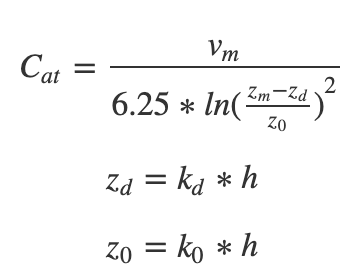

```{r setup, include=FALSE}
knitr::opts_chunk$set(echo = TRUE,
                      message = FALSE, 
                      warning = FALSE)

#install packages if necessary, then load libraries
if (!require(librarian)){
  install.packages("librarian")
  library(librarian)
}

librarian::shelf(
  purrr,
  sensitivity,
  pse,
  here,
  tidyverse)
```

# Introduction

For this assignment, we are interested in estimating vegetation or crop water by first estimating atmospheric conductance, which is how easily water diffuses into the air. Atmospheric conductance depends on factors such as windspeed (you get more evaporation in windier conditions), the vegetation itself, and the turbulence it creates.

# 1. Code a function to compute atmospheric conductance C~at~ (how easily vapor diffuses from vegetation surfaces)



*Note that:*

-   *`zm`: height at which windspeed is measured (usually 200cm above the vegetation)*

-   *`h`: vegetation height (cm)*

-   *`v`: windspeed (cm/sec)*

-   *`kd`: 0.7*

-   *`ko`: 0.1*

```{r}
#source in atmospheric conductance (cat) function 
source(here("functions", "compute_cat.R"))
```

# 2. Run your model

*You are estimating the atmospheric conductance for a forest that is 10 m high (the accuracy of that measurement is +/- 0.5 m ) Windspeeds (`v`) in this region are normally distributed with a mean of 250 cm/s with a standard deviation of 30 cm/sec.*

*Come up with a single estimate of atmospheric conductance for this forest.*

Set up the C~at~ model parameters:

-   number of samples

-   `h`: vegetation height (m)

-   `v`: windspeed (cm/sec)

```{r}
#parameters
nsamples = 100

#convert m to cm to match the windspeed units 
h_default <- 10 * 100 
h_deviation = 0.5 * 100

#sample from the uniform distribution of plant heights based on the given forest height accuracy of +/- 0.5m 
h <- runif(min = h_default - h_deviation, 
           max = h_default + h_deviation,
           n=nsamples)

v_mean <- 250
v_sd <- 30

#sample the normal distribution of windspeeds based on the given mean and SD values 
v <- rnorm(mean = v_mean, sd = v_sd, n = nsamples)

#bind vegetation height (h) and windspeed (v) into a parameters dataframe 
parameters <- cbind.data.frame(h, v)
```

Run the model

```{r}
results <- compute_cat(h = parameters$h, v = parameters$v)

mean_cat <- round(mean(results), digits = 2)
#should be 15.44 ?
```

The model estimates that the mean atmospheric conductance for this forest is approximately `r mean_cat` cm/sec.

# 3. Now do a sensitivity analysis as follows

*Consider the sensitivity of your estimate to uncertainty in the following parameters and inputs*

-   *`h`*: vegetation height (cm)

-   *`kd`*

-   *`ko`*

-   *`v`*: windspeed (cm/sec)

*Windspeeds (`v`) are normally distributed with a mean of 250 cm/sec with a standard deviation of 30 cm/sec*

*For vegetation height assume that height is somewhere between 9.5 and 10.5 m (but any value in that range is equally likely)*

*For the `kd` and `ko` parameters you can assume that they are normally distributed with standard deviation of 1% of their default values*

## a) *use LHS to generate parameter values for the 4 parameters*

Note the following sample distribution types:

1.  v - normally distributed
2.  h - uniform distribution
3.  k0 - normally distributed
4.  kd - normally distributed

```{r}
#consider the 4 parameters
factors = c("v", "h", "k0", "kd")

#decide how many parameter sets to generate
nsets=100

#note which parameter uses which type of distribution 
q = c("qnorm", "qunif", "qnorm", "qnorm")

#generate the distributions for each parameter 
q.arg = list(list(mean = 250, sd = 30),               #v
             list(min = 9.5 * 100, max = 10.5 * 100), #h
             list(mean = k0_default, sd = k0_sd),     #k0
             list(mean = kd_default, sd = kd_sd))     #kd

# generate samples from LHS
sens_cat = LHS(NULL, factors, nsets, q, q.arg) 
sens_parameters = get.data(sens_cat) #we want to know what parameters we want to run 
head(sens_parameters) #we can look at all the parameter values we want to run - we will have 100 parameter sets 
```

## b) run you atmospheric conductance model for these parameters and return aerodynamic conductances

```{r}
conductances <- sens_parameters %>% pmap(compute_cat) 
conductances_test <- as.data.frame(unlist(conductances))

#yieldsd = conductances %>% map_dfr(`[`)

sens_cat = pse::tell(sens_cat, t(as.matrix(conductances_test)),
                        res.names=c("conductance"))
```

## c) Plot conductance estimates in a way that accounts for parameter uncertainty

```{r}
tmp = conductances_test %>% gather(value="value", key="yield")

ggplot(tmp, aes(y = value)) + 
  geom_boxplot() +
  labs(y="Atmospheric Conductance (cm/sec)") + 
  theme_classic()
```

## d) Plot conductance estimates against each of your parameters

```{r}
pse::plotscatter(sens_cat, col="blue", cex=5)
```

## e) Estimate the Partial Rank Correlation Coefficients

```{r}
pse::plotprcc(sens_cat)
```

## f) Discuss what your results tell you about how aerodynamic conductance? What does it suggest about what you should focus on if you want to reduce uncertainty in aerodymaic conductance estimates? Does this tell you anything about the sensitivity of plant water use to climate change?
